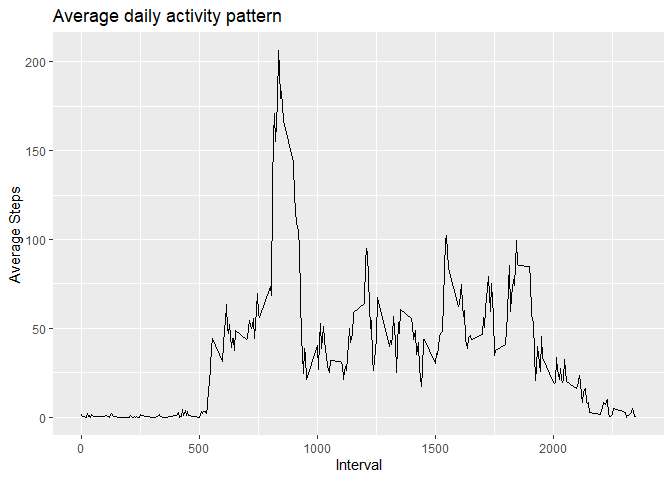
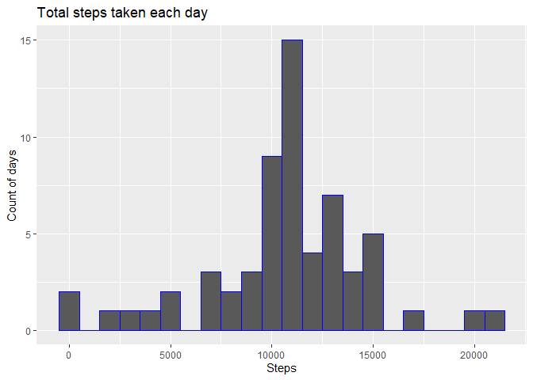
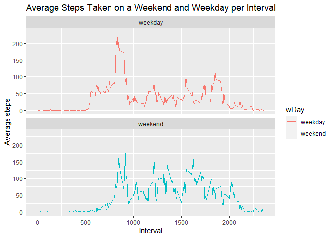

## Introduction

This assignment will look at the data found in the activity zip and answering a series of questions 1 through 5. There is no commenting found in the code, this can be found in this document prior to the code itself.

## Q1. Loading and preprocessing the data
This code unzips the activity zip file and reads the data. It also creates a variable of clean data with NAs removed.


```r
data <- read.csv(unz("activity.zip", "activity.csv"), header=T, sep=",")
dataclean <-na.omit(data)
```

## Q2. What is mean and median total number of steps taken per day?
This code identifies from the clean data set the total number of steps per day and presents it in a histogram. It then calculates the mean and median total steps per day.

```r
library(lubridate)
library(dplyr)
library(ggplot2)
options(scipen = 1, digits = 2)

dataclean$date<-as.Date(dataclean$date, format = "%Y-%m-%d")
stepsaday <- dataclean %>% group_by(date) %>% summarise(steps = sum(steps))

ggplot(stepsaday, aes(x=steps)) + geom_histogram(binwidth = 1000, col = "blue") + labs(x = "Steps") + labs(y = "Count of days for each Total Steps") + labs(title = "Total steps taken each day")
```

<!-- -->

```r
meansteps <- mean(stepsaday$steps)
medsteps <- median(stepsaday$steps)
```

**The mean total number of steps taken per day is 10766.19 and the median is 10765.**

## Q3. What is the average daily activity pattern?
This identifies the average steps per interval in the day and presents it in a line graph.

```r
data$date<-as.Date(data$date, format = "%Y-%m-%d")
activity <- data %>% group_by(interval) %>% summarise(steps = mean(steps, na.rm=TRUE))
ggplot(activity, aes(x=interval, y = steps)) + geom_line() + labs(x = "Interval") + labs(y = "Average Steps") + labs(title = "Average daily activity pattern")
```

<!-- -->

```r
maxrow<- activity[which.max(activity$steps), ]
maxrow$interval
```

```
## [1] 835
```

**The interval of the day that has the maxium number of steps is 835. **

## Q4. Imputing missing values
This code identifies all the missing values and replaces them with the mean for that interval of the day. It then calculates the total number of steps per day and presents it in a histogram. The mean and median total steps per day is then displayed.


```r
nas<- sum(is.na(data))
print(nas)
```

```
## [1] 2304
```

```r
data$date<-as.Date(data$date, format = "%Y-%m-%d")
data <- data %>% group_by(interval) %>% mutate(stepsmean = mean(steps, na.rm = TRUE))

data1 <- as.data.frame(data)
data1$steps[is.na(data1$steps)] <- data1$stepsmean[is.na(data1$steps)]

stepsadayrep <- data1 %>% group_by(date) %>% summarise(steps = sum(steps), mean(steps))

ggplot(stepsadayrep, aes(x=steps)) + geom_histogram(binwidth = 1000, col = "blue") + labs(x = "Steps") + labs(y = "Count of days") + labs(title = "Total steps taken each day")
```

<!-- -->

```r
meanr<-mean(stepsadayrep$steps)
medianr<-median(stepsadayrep$steps)
```

**The mean total number of steps taken per day is 10766.19 and the median is 10766.19.**

## Q5. Are there differences in activity patterns between weekdays and weekends?

This identifies which dates a weekdays or weekends. The average steps for each time interval is then calculated and displayed in a panel plot.


```r
weekdays1 <- c('Monday', 'Tuesday', 'Wednesday', 'Thursday', 'Friday')
data$wDay <- c('weekend', 'weekday')[(weekdays(data$date) %in% weekdays1)+1L]
dataweeks <- data %>% group_by(wDay, interval) %>% mutate(stepsmean = mean(steps, na.rm = TRUE))

weeks <- ggplot(data = dataweeks, aes(x = interval, y = stepsmean, color = wDay)) + geom_line()
weeks + facet_wrap(~wDay, ncol =1)+labs(x = "Interval") + labs(y = "Average steps") + labs(title = "Average Steps Taken on a Weekend and Weekday per Interval")
```

<!-- -->
